# JupyterLab Desktop App のインストール

演習を実施するために [**JupyterLab Desktop App**](https://github.com/jupyterlab/jupyterlab-desktop) をインストールします。

集合形式の演習などでは事前に JupyterLab Desktop App がインストールされているかもしれません。  
その場合は以下の手順は不要です。

> この演習は JupyterLab Desktop App で実施することを前提としています。  
> 初心者、入門者などでも環境構築しやすいこと、および集合形式の演習時に事前の環境構築がしやすいことが理由です。
>
> その他の Python 実行環境でも特に問題なく実行できるはずですが、それらについてはここでは触れません。

---

## 1. JupyterLab Desktop App をダウンロード

[JupyterLab Desktop App](https://github.com/jupyterlab/jupyterlab-desktop/releases) の最新版をダウンロードします。

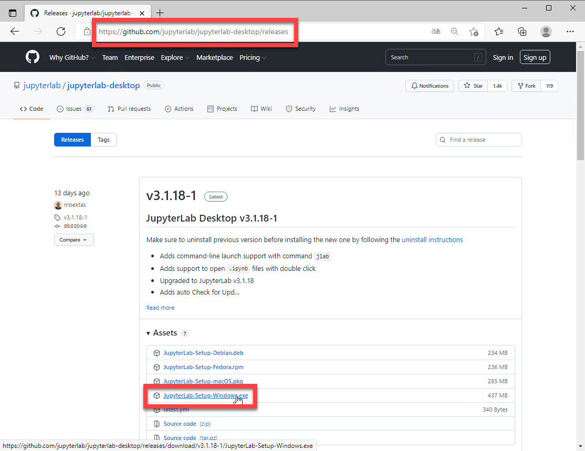

その際に警告が表示されるかもしれません。  

> JupterLab Desktop App は安全なアプリケーションだと考えられますが、自身の判断でダウンロードを中止してください。  
> その場合は Python の他の開発環境を用意してください。

警告表示されても Windows の場合には以下の手順でダウンロードを実行できます。

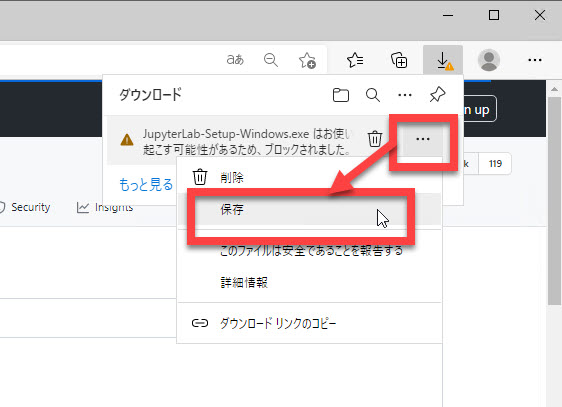
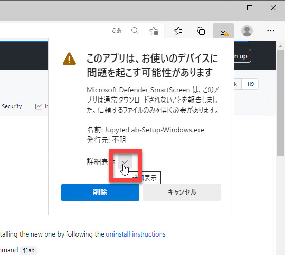
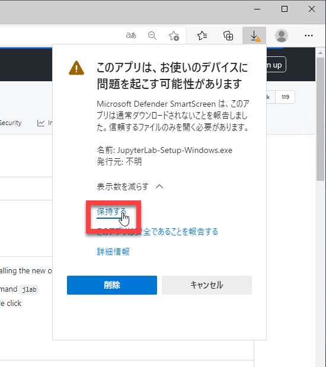

---

## 2. JupyterLab Desktop App をインストール

インストーラーがダウンロードできたらインストールを実行します。

インストール時にも警告が表示されるかもしれません。  
以下の手順でインストールを実行できます。

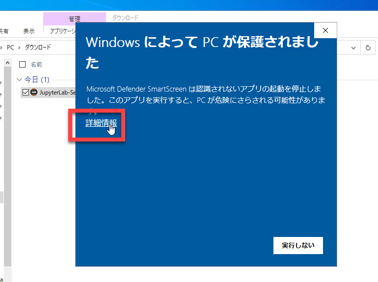
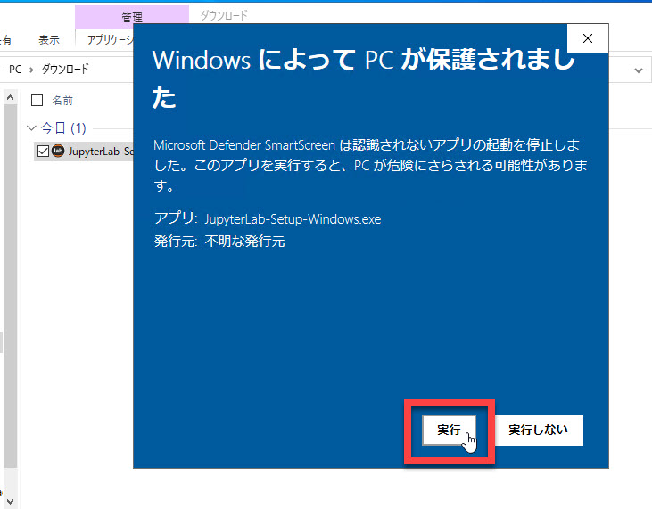

インストーラーでは以下のオプション設定をお勧めします。

[Select Installation Type] では "Just Me" を選択します。

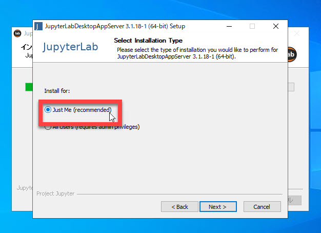

[Advanced Installation Options] では "Clear the package cache upon completion" のみチェックします。

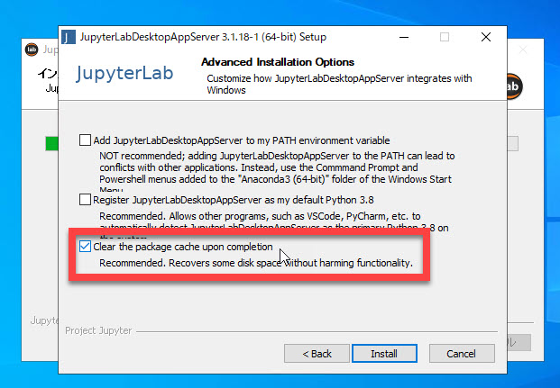

---

## 3. 演習コンテンツをダウンロード

GitHub のリポジトリ [PythonAITraining](https://github.com/seosoft/PythonAITraining) をダウンロードします。  
[Code]-[Download Zip] からダウンロードできます。  

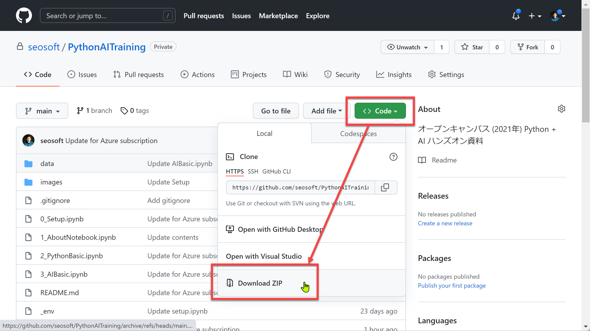

> GitHub を知っていればクローンしてもかまいません。

ZIP ファイルをダウンロードできたら展開（解凍）します。

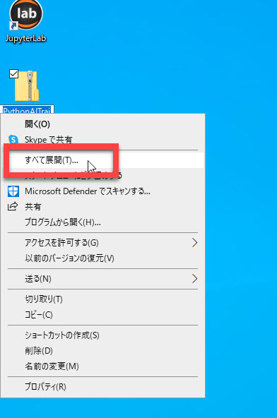

---

## 4. 演習コンテンツをコピー

エクスプローラーで "**%userprofile** を開きます。

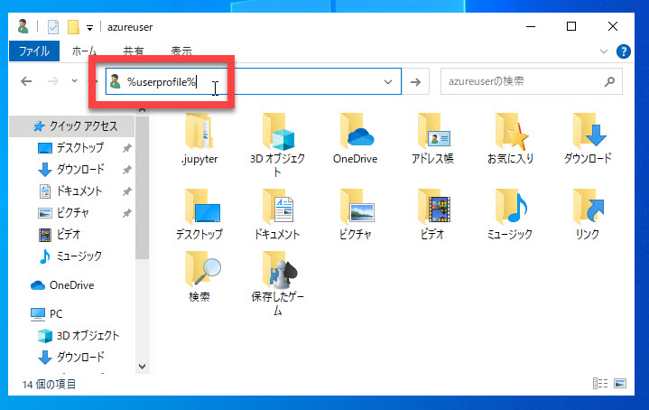

展開した演習コンテンツを %userprofile% にコピーします。

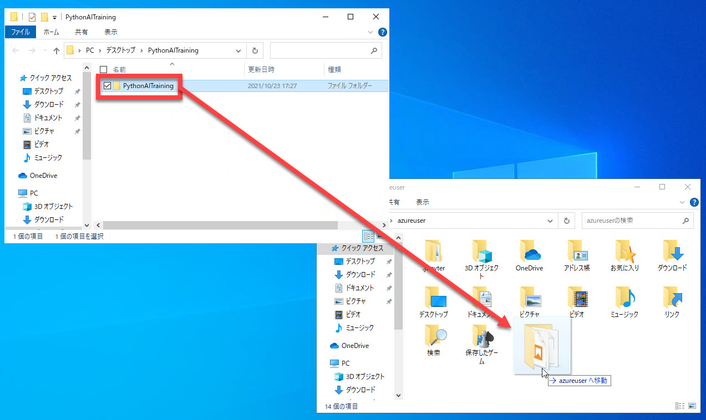

---

## 5. JupyterLab Desktop App を開く

JupyterLab Desktop App を開きます。

"PythonAITraining" フォルダーがあれば演習の準備は完了です。

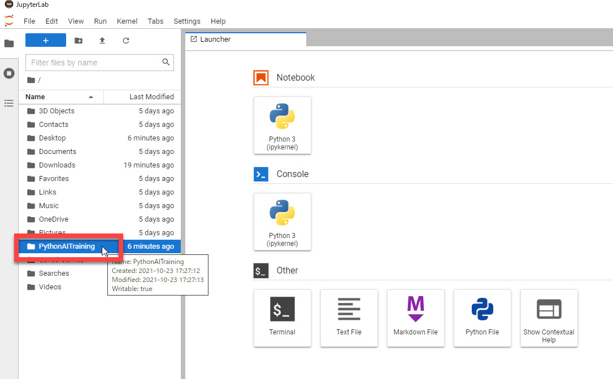